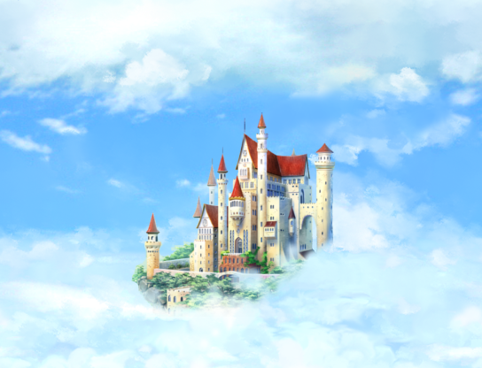

<h1>Прерванный ритуал</h1>
<h2>Описание</h2>

В облачном королевстве Азур баланс сил поддерживался 4 камнями бытия:
<ol>
    <li>   Жизнь</li>
    <li>   Сила</li>
    <li>   Хаос</li>
    <li>   Пространство</li>
</ol>
И 4 могучими героями, что каждый цикл перерождаются в новом теле:
<ol>
    <li>   Воин - мастер клинка</li>
    <li>   Рыцарь - несокрушимый щитоносец</li>
    <li>   Маг - адепт стихий</li>
    <li> Ниндзя - мастер проникновений</li>
</ol>
В результате <strong>Катаклизма Маны</strong>, случившегося месяц назад, камни пропали.

Гильдии магов удалось найти их магический след, но точно локализовать успели только камень Жизни.

Камень Жизни упал на летающий остров Древа Судеб. Под воздействием сил каждый из камней раскололся на две части.

Нашим героям нужно торопиться, ведь без камней магия островов Азур иссякнет и королевство обрушиться на жителей нижнего мира

-------------------------------------------------------------------------

Запуск игры - BrokenRitual.py

Запуск редактора уровней - LevelEditor.py (не смотрите уровни перед игрой - потеряется интерес к исследованию)

Вспомогательные файлы в папке <strong>scripts</strong>:
<ol>
    <li>Класс кнопок интерфейса - cButton.py</li>
    <li>Класс слайдоров интерфейса - cSlider.py</li>
    <li>Менеджер предметов(дроп с моба, использование) - dropmanager.py</li> 
    <li>Классы Игрок, виды мобов, предметы - entities.py</li>
    <li>Движение облаков по небу - paralax.py</li>
    <li>Класс Частица(искользуеться в анимациях) - particle.py</li>
    <li>Класс снарядов - projectile.py</li> 
    <li>Менеджер звука(включение/загрузка настроек) - soundmanager.py</li> 
    <li>Класс искр(выстрелы/попадания/обстены) - spark.py</li>
    <li>Классы заклинаний мага - spell.py</li>
    <li>Класс карта(разные проверки/загрузка и сохранение в JSON) - tilemap.py</li> 
    <li>Утилитарные функции(загрузка ассетов объектов/отрисовка текстов/ Класс анимационных объектов) - utility.py</li> 
</ol>
<h2>Инструкция для пользователя игры:</h2>

Если боитесь "сгореть" на пляже, то поиграйте в эту игру и лето пролетит незаметно.

В игре 6 уровней + возможность модификации/добавления новых через редактор уровней

На каждом уровне для успешного завершений необходимо найти один осколок камней бытия, например Жизни, и подойти к магическому указателю направления от гильдии магов - он перенесёт вас на следующий магический след.

Исследуйте локации - хитрые гоблины везде наделали потайных лазов

<h3> Главное Меню</h3>

Новая игра - выбор героя и начало приключения

Зал героев - десятка лучших реинкарнация могучей четвёрки королевства Азур

Настройки - окно выбора громкости музыки, звуков окружения и игровых эффектов

Клавиша <STRONG>ESCAPE</STRONG> - выход из приложения

<h3> Новая игра</h3>

4 кнопки выбора игрового класса.

При наведении на каждую кнопку появляеться подробное описание героя.

Дополнительно окно описания героя можно вызвать во время игры при нажатии <strong>F1</strong>

<h3>Окно ввода имени реинкарнации легендарного героя</h3>

На данном этапе нельзя вернуться в предыдущие меню(исправим в будущем патче).

Введите с клавиатуры имя и нажмите <strong>ENTER</strong>

<h3>Меню паузы</h3>

Открываеться во время игры при нажатии клавиши <strong>ESCAPE</strong>

<h3>Игровой процесс</h3>

D -  движение вправо 
    A -  движение влево 
    E -  атака 
    SPACE - прыжок 
----------------------- 
Только для мага:
    E - создать 1ое заклинание(Классический пиу) 
    R - создать 2ое заклинание(Сильный пиу) 
    T - создать 3е заклинание(Защити себя) 
    Y - создать 4е заклинаниe(Анигилируй всех с 1 хп, но предметы не выпадут ведь они же рассыпались в прах) 
------------------------

Герой разобьёться если упасть с большой высоты не скользя  по стене ~3 секунды

Все герои умеют хвататься за стены и катиться вниз или отталкнуться от стеныб если катился по ней

Три параметра персонажа:

<ol>
<li>Жизнь - не восстанавливаеться сама(а как вы хотели - это Азур), закончилась жизнь - закончилась ваша реинкарнация</li>
<li>Мана - восстанавливаеться со временем, но только маги умеют ей управлять</li>
<li>Выносливость - восстанавливаеться со временем, используеться для блокировок оружием и щитом(У ниндзи не успел реализовать спец приём)</li>
</ol>

С поверженных врагов с некоторым шансом могут выпасть:

<ol>
<li>Зелье лечения +1HP </li>
<li>Зелье маны +2MP </li>
<li>Зелье выносливости +2 </li>
<li>Монетка </li>
</ol>
<h2>Данные</h2>

Данные о 10 героях(Лидер борд) <i>herohall/hall.txt</i>

Настройки звука <i>settings.txt</i>

Карты уровней <i>maps/*.json</i>

-------------------------------------------------------------------------------------------

<strong>Для запуска приложения в PowerShell или CMD выполни "python BrokenRitual.py" (Windows)</strong>

Из-за сжатых сроко разработки не реализованы к дедлайну, но буду добавлены в следующем DLC:

Продвижение по сюжету - узнаем кто или что стоит за "Катаклизмом Маны"

Боссы для каждого камня бытия.

Система экипировки

Гильдия магов как игровой хаб

Система мастерства героев

Глобальная карта королевства

Смена времени суток - Шейдеры, правда pygame с ними работает только незадокументированно

И многое другое...

P.S. - надеюсь вы увидите приведение до того как оно настигнет вас🤭

